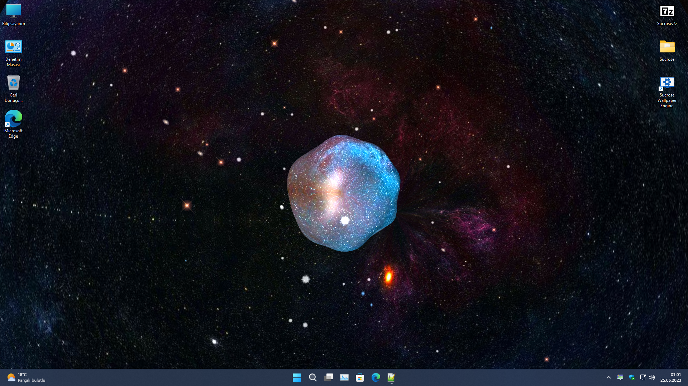
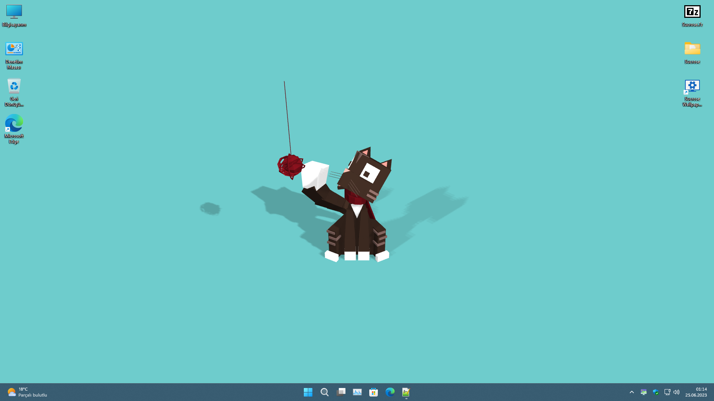
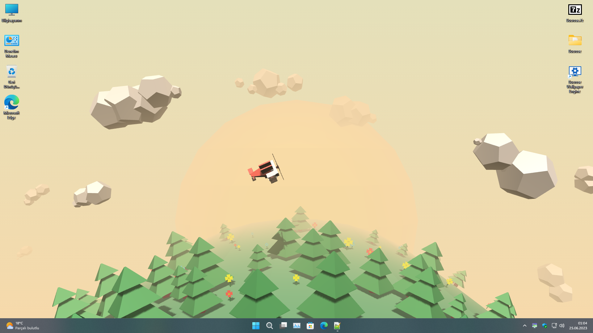
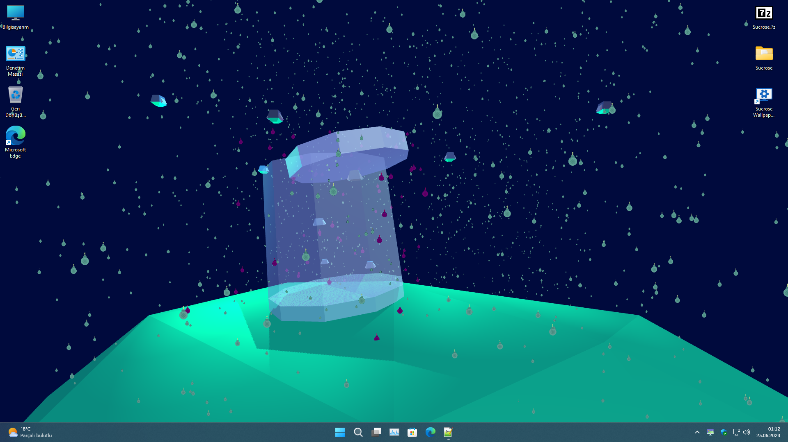
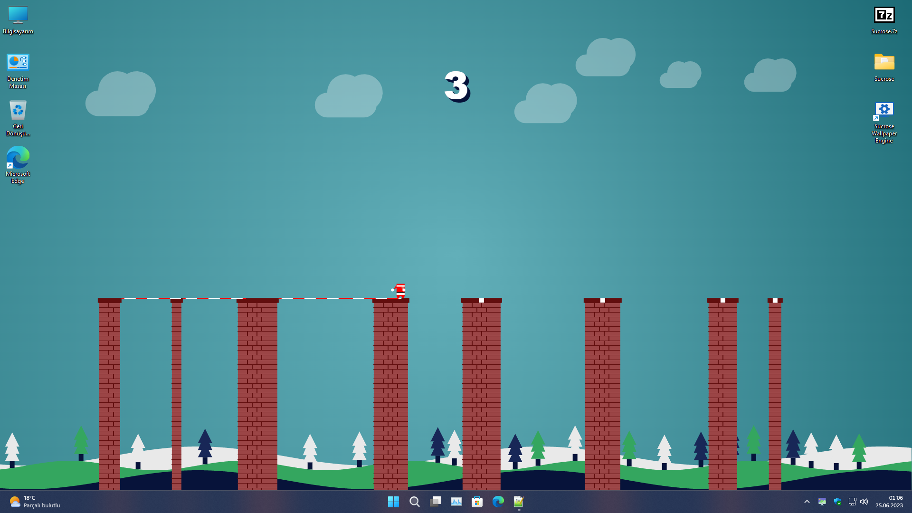

  
  <h2 align="center">Sucrose - Wallpaper Engine</h2>

  <b>Sucrose</b> is a versatile wallpaper engine that brings life to your desktop with a wide range of interactive themes.

<h4 align="center">
  <a href="https://github.com/Taiizor/Sucrose/issues">Issues</a>
  •
  <a href="https://github.com/Taiizor/Sucrose/discussions">Discussions</a>
  •
  <a href="https://github.com/Taiizor/Sucrose/wiki">Documentation</a>
  •
  <a href="https://github.com/Taiizor/Wallpaper">Wallpaper</a>
  •
  <a href="https://discord.gg/nxG977byXb">Discord</a>
</h4>

  

  
  
  
  
  
  

  
  
  
  

  
  

  
  

  
  

  <!--
  
  -->

  <!--
  
  
  
  -->

## Features

*Take a moment, preview GIF clips may take some time to load.*

#### Wallpaper Varieties
| Theme Type | Example |  Interactive | Resolution | Performance |
|--|--|--|--|--|
| Gif |  Sample Gif Theme | No | Variable | Fixed |
| Url |  Sample Url Theme | Yes | Fixed | Variable |
| Web |  Sample Web Theme | Yes | Fixed | Variable |
| Video |  Sample Video Theme | No | Variable | Fixed |
| YouTube |  Sample YouTube Theme | No | Fixed | Variable |
| Application |  Sample Application Theme | No | Fixed | Variable |

#### Interactive Features
- **Audio Visualization:** Display real-time audio visualization on your wallpapers.
- **Hardware Monitoring:** Show CPU, GPU, RAM usage and more on your wallpapers.
- **Interactivity:** Allow users to interact with themes using mouse and keyboard actions.
- **JavaScript Integration:** Send computer data to JavaScript functions in themes for customization.

#### Create and Share Themes
- Create your own custom themes and share them with friends or the Sucrose community.
- Explore a gallery of user-submitted themes and download them directly from the Sucrose store.

#### Performance
- Optimize CPU and GPU usage for smooth performance.
- Auto-pause wallpapers when fullscreen applications/games run to conserve resources.
- Power-saving mode to pause wallpapers when running on battery (laptops).

## Download

<!--**Microsoft Store**

-->

**GitHub**

## Support
We appreciate any contribution to Sucrose. Here are some ways to support the project:

#### Developer
- Contribute to the codebase and help improve Sucrose.

#### Designer
- Improve the UI/UX of Sucrose for a better user experience.

#### Localization
- Help translate Sucrose into more languages to reach a broader audience.

#### Feedback & Bug Reports
- Suggest new features or report bugs to help us improve Sucrose.

#### Spread the Word
- Star this repository and share your experiences with Sucrose on social media.