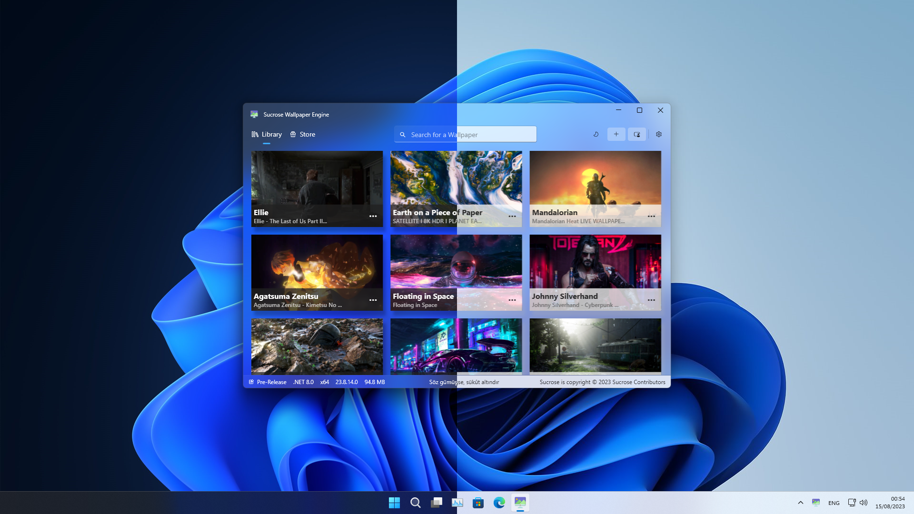
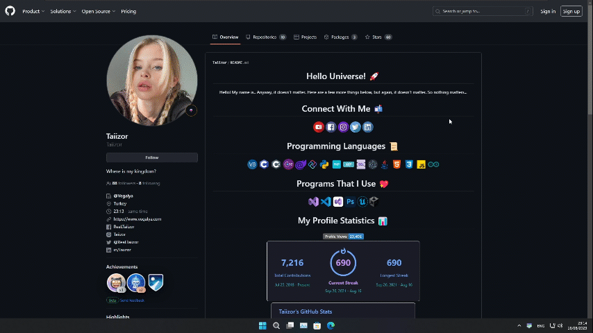
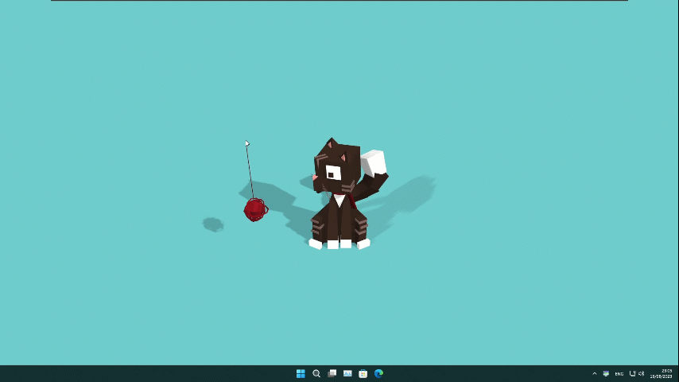
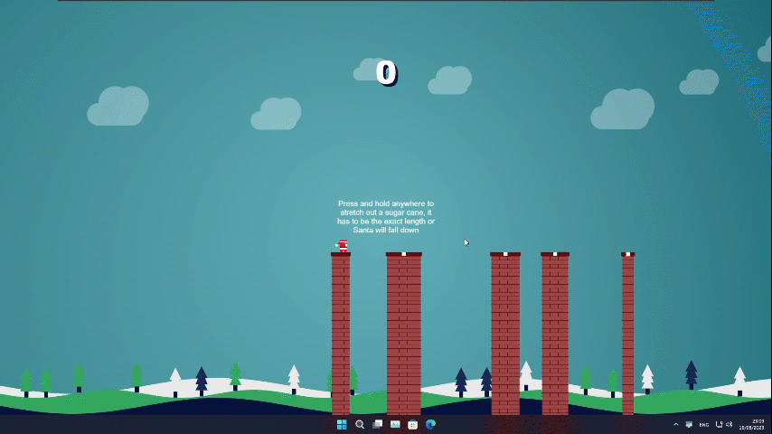

  
  <h2>Sucrose - Wallpaper Engine</h2>

  
    <b>Sucrose</b> is a versatile wallpaper engine that brings life to your desktop with a wide range of interactive themes.
  

<h4 align="center">
  <a href="https://github.com/Taiizor/Sucrose/issues">Issues</a> ●
  <a href="https://github.com/Taiizor/Sucrose/discussions">Discussions</a> ●
  <a href="https://github.com/Taiizor/Sucrose/wiki">Documentation</a> ●
  <a href="https://github.com/Taiizor/Store">Store</a> ●
  <a href="https://www.youtube.com/playlist?list=PLPU_0X-WyJi7WSUHItUfxbr71ORthre19">Preview</a> ●
  <a href="https://www.youtube.com/playlist?list=PLPU_0X-WyJi5eNcBrRkEg9uoGX0R1Z5SY">Tutorial</a> ●
  <a href="https://discord.gg/nxG977byXb">Discord</a>
</h4>

  

  
  
  
  
  
  

  
  
  
  

  
  

  
  

  
  

  <!--
  
  -->

  <!--
  
  
  
  -->

  <h2>Features</h2>
  

    <em>Take a moment, preview GIF clips may take some time to load.</em>
  

  <h4>Wallpaper Varieties</h4>
  <table align="center" style="margin:auto">
    <tr>
      <th>Theme Type</th>
      <th>Example</th>
      <th>Interactive</th>
      <th>Resolution</th>
      <th>Performance</th>
    </tr>
    <tr align="center">
      <td>Gif</td>
      <td>
        
         <a href="https://github.com/Taiizor/Store/blob/develop/src/RGB/Asus ROG-1">Asus ROG</a> Theme
      </td>
      <td>No</td>
      <td>Variable</td>
      <td>Fixed</td>
    </tr>
    <tr align="center">
      <td>Url</td>
      <td>
        
         Taiizor Theme
      </td>
      <td>Yes</td>
      <td>Fixed</td>
      <td>Variable</td>
    </tr>
    <tr align="center">
      <td>Web</td>
      <td>
        
         <a href="https://github.com/Taiizor/Store/blob/develop/src/Animal/Cat vs Ball of Wool-1">Cat vs Ball of Wool</a> Theme
      </td>
      <td>Yes</td>
      <td>Fixed</td>
      <td>Variable</td>
    </tr>
    <tr align="center">
      <td>Video</td>
      <td>
        
         <a href="https://github.com/Taiizor/Store/blob/develop/src/Game/The Last of Us Part II-1">The Last of Us Part II</a> Theme
      </td>
      <td>No</td>
      <td>Variable</td>
      <td>Fixed</td>
    </tr>
    <tr align="center">
      <td>YouTube</td>
      <td>
	    
         <a href="https://github.com/Taiizor/Store/blob/develop/src/Space/Floating in Space-1">Floating in Space</a> Theme
      </td>
      <td>No</td>
      <td>Fixed</td>
      <td>Variable</td>
    </tr>
    <tr align="center">
      <td>Application</td>
      <td>
        
         Santa's Helper Theme
      </td>
      <td>No</td>
      <td>Fixed</td>
      <td>Variable</td>
    </tr>
  </table>

  

    <h4>Interactive Features</h4>
    
● <strong>Audio Visualization:</strong> Display real-time audio visualization on your wallpapers.

    
● <strong>Hardware Monitoring:</strong> Show CPU, GPU, RAM usage and more on your wallpapers.

    
● <strong>Interactivity:</strong> Allow users to interact with themes using mouse and keyboard actions.

    
● <strong>JavaScript Integration:</strong> Send computer data to JavaScript functions in themes for customization.

  

  

    <h4>Create and Share Themes</h4>
    
● Create your own custom themes and share them with friends or the Sucrose community.

    
● Explore a gallery of user-submitted themes and download them directly from the Sucrose store.

  

  

    <h4>Performance</h4>
    
● Optimize CPU and GPU usage for smooth performance.

    
● Auto-pause wallpapers when fullscreen applications/games run to conserve resources.

    
● Power-saving mode to pause wallpapers when running on battery (laptops).

  

  <h2>Download</h2>

  <strong>Microsoft Store</strong>

  <table align="center" style="margin:auto">
    <tr>
      <th>.NET</th>
      <th>x64</th>
      <th>x86</th>
      <th>ARM64</th>
    </tr>
    <tr align="center">
      <td>.NET Framework 4.8</td>
      <td>
        
      </td>
      <td>
        
      </td>
      <td>
        
      </td>
    </tr>
  </table>

  

  <strong>GitHub</strong>

  <table align="center" style="margin:auto">
    <tr>
      <th>.NET</th>
      <th>x64</th>
      <th>x86</th>
      <th>ARM64</th>
    </tr>
    <tr align="center">
      <td>.NET Framework 4.8</td>
      <td>
        
      </td>
      <td>
        
      </td>
      <td>
        
      </td>
    </tr>
    <tr align="center">
      <td>.NET Framework 4.8.1</td>
      <td>
        
      </td>
      <td>
        
      </td>
      <td>
        
      </td>
    </tr>
    <tr align="center">
      <td>.NET 6.0</td>
      <td>
        
      </td>
      <td>
        
      </td>
      <td>
        
      </td>
    </tr>
    <tr align="center">
      <td>.NET 7.0</td>
      <td>
        
      </td>
      <td>
        
      </td>
      <td>
        
      </td>
    </tr>
    <tr align="center">
      <td>.NET 8.0</td>
      <td>
        
      </td>
      <td>
        
      </td>
      <td>
        
      </td>
    </tr>
  </table>

  <h2>Support</h2>
  
We appreciate any contribution to Sucrose. Here are some ways to support the project:

  

    <h4>Developer</h4>
    
● Contribute to the codebase and help improve Sucrose.

  

  

    <h4>Designer</h4>
    
● Improve the UI/UX of Sucrose for a better user experience.

  

  

    <h4>Localization</h4>
    
● Help translate Sucrose into more languages to reach a broader audience.

  

  

    <h4>Feedback &amp; Bug Reports</h4>
    
● Suggest new features or report bugs to help us improve Sucrose.

  

  

    <h4>Spread the Word</h4>
    
● Star this repository and share your experiences with Sucrose on social media.

  

